# ChatGPT 安卓版

你的私人 AI 助理，只要在 app 设置你的 Openai API Key，就可以随时随地和 AI 聊天，并且支持上下文对话，聊天历史随时查看。

> 安全提示：
> 
> 1、API Key 只存在本地（如果二次开发请不要把 key 上传到开源仓库）
> 
> 2、APP 聊天历史只存在本地

## 主要功能

- 聊天/绘画功能
    - OpenAI API: GPT-3.5/GPT-4（是否支持GPT4，依赖你的 API Key）
- 语音功能（商用版支持）
    - Azure Speech SDK: 语音切换

## 配置

- OpenAI API Key
- Azure Speech Key
  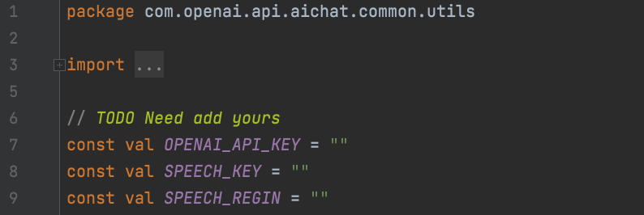

## App 截图

### 开源版本

- 聊天
- 绘画
- 历史

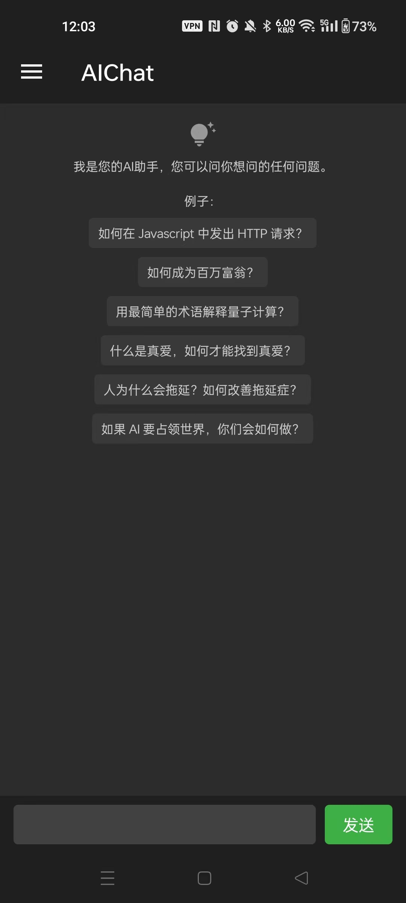
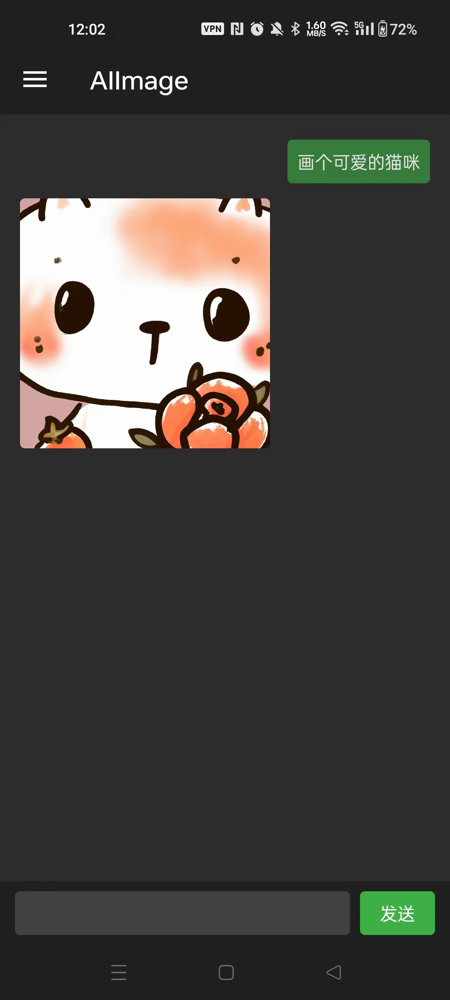
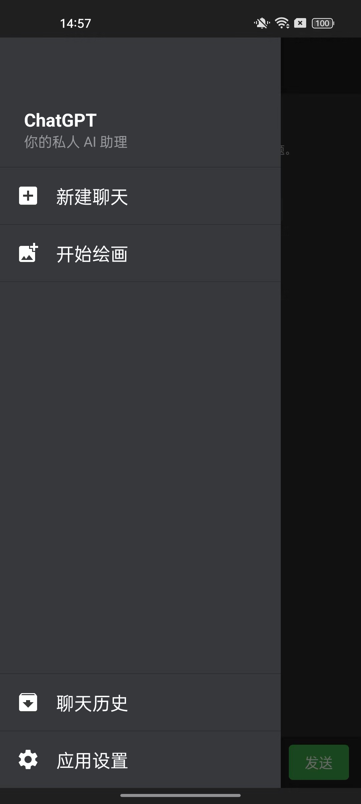
  
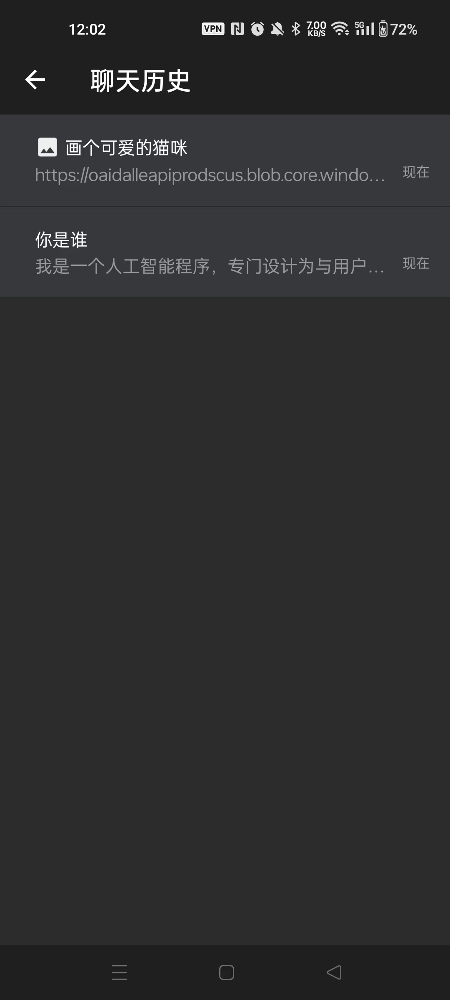
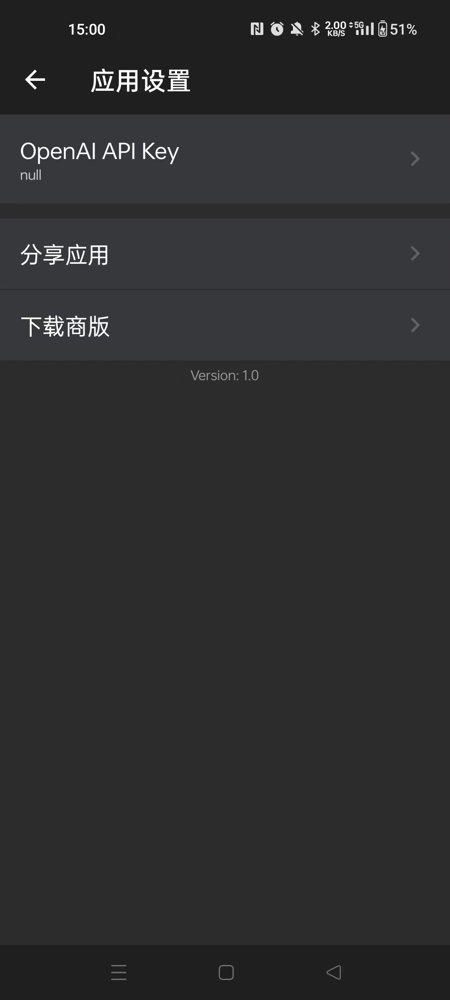

### 商用版本

- 聊天
- 绘画
- 历史
- 语音

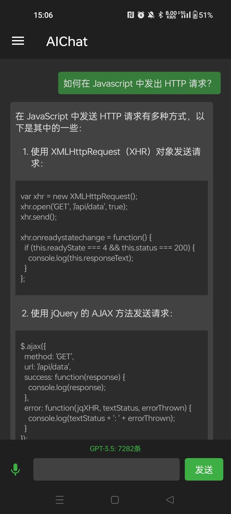
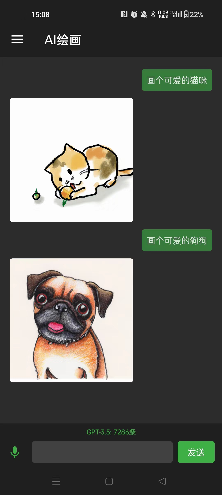
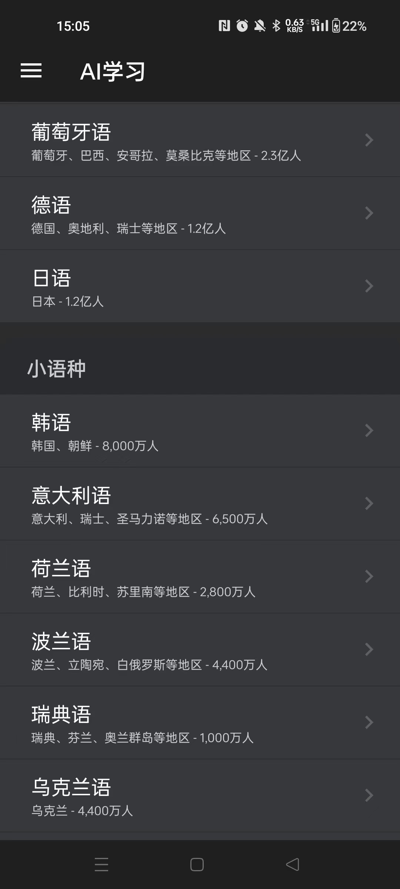
  
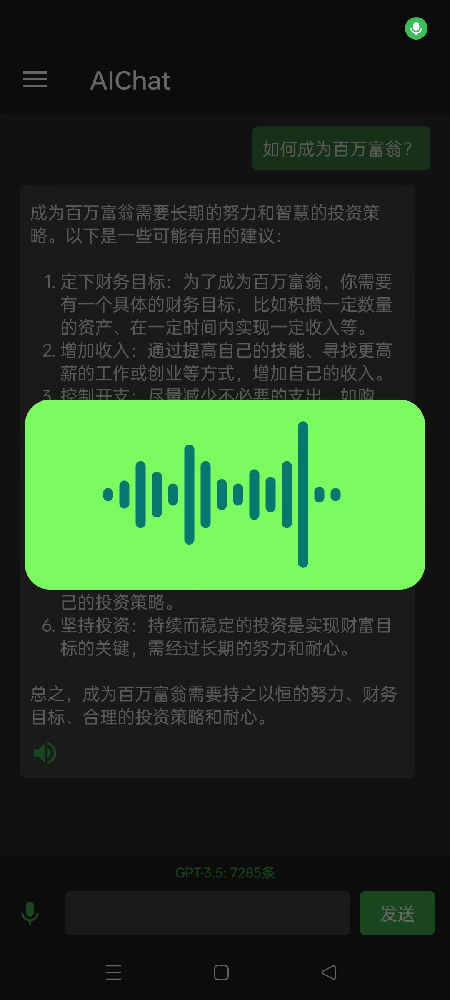

## App 下载

### 商用版本

下载地址：[https://www.pgyer.com/Fq458k](https://www.pgyer.com/Fq458k)

或
二维码

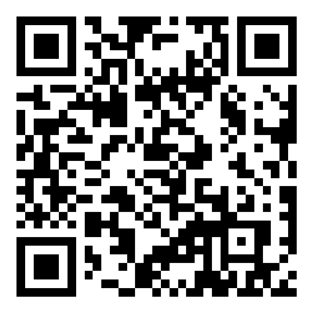

## QQ交流群

### ChatGPT-APP-AIChat 交流群: 824060029

## License

MIT License

Copyright (c) 2023 Ouyang Jinmiao

Permission is hereby granted, free of charge, to any person obtaining a copy of this software and
associated documentation files (the "Software"), to deal in the Software without restriction,
including without limitation the rights to use, copy, modify, merge, publish, distribute,
sublicense, and/or sell copies of the Software, and to permit persons to whom the Software is
furnished to do so, subject to the following conditions:

The above copyright notice and this permission notice shall be included in all copies or substantial
portions of the Software.

THE SOFTWARE IS PROVIDED "AS IS", WITHOUT WARRANTY OF ANY KIND, EXPRESS OR IMPLIED, INCLUDING BUT
NOT LIMITED TO THE WARRANTIES OF MERCHANTABILITY, FITNESS FOR A PARTICULAR PURPOSE AND
NONINFRINGEMENT. IN NO EVENT SHALL THE AUTHORS OR COPYRIGHT HOLDERS BE LIABLE FOR ANY CLAIM, DAMAGES
OR OTHER LIABILITY, WHETHER IN AN ACTION OF CONTRACT, TORT OR OTHERWISE, ARISING FROM, OUT OF OR IN
CONNECTION WITH THE SOFTWARE OR THE USE OR OTHER DEALINGS IN THE SOFTWARE.