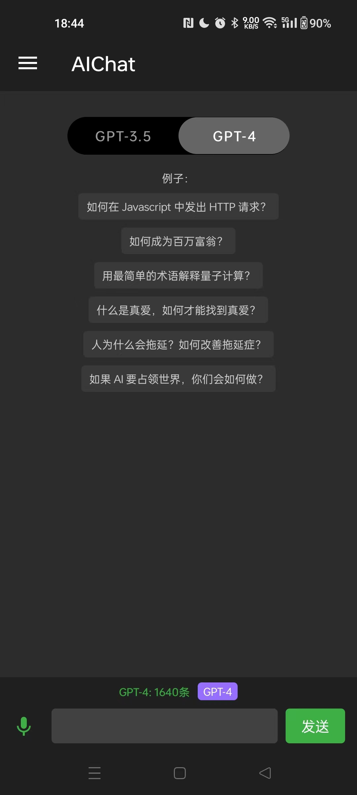
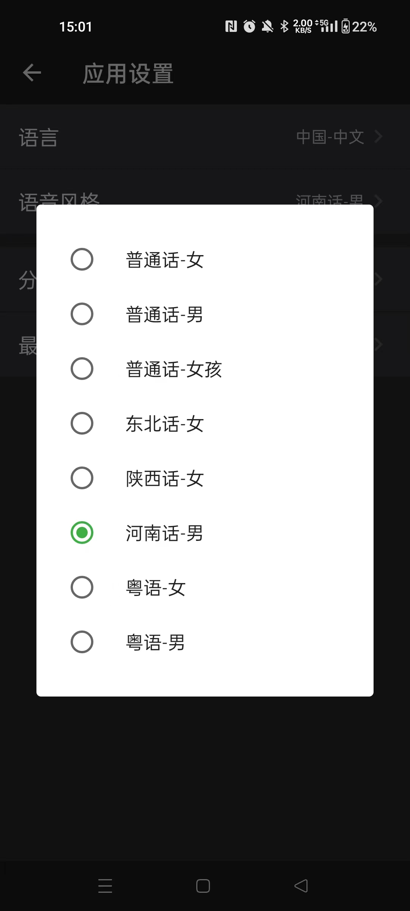

# ChatGPT 安卓版 - 私人定制 AI

私人定制 AI，只要在 App 里设置你的 Openai API Key，就可以随时随地和 AI 聊天，并且支持上下文对话，聊天历史随时查看。

[开源版本](#开源版本预览)是直接调用的 Openai API 接口，所以需要挂 VPN。  
[商用版本](#商用版本预览)走的服务器反向代理，无需 VPN，且无需注册，即开即用，非常方便，还支持语言聊天，神经网络语音非常逼真，非常适合学习外语。

> 安全提示：  
> 1、API Key 只存在本地（如果二次开发请不要把 key 上传到开源仓库）  
> 2、APP 聊天历史只存在本地

## 功能

- 聊天/绘画功能
    - OpenAI API: GPT-3.5/GPT-4（是否支持GPT4，依赖你的 API Key）
- 语音（商用版支持）
    - Azure Speech SDK: 语音切换

## 配置

- OpenAI API Key

### 两种方式设置 API Key：

#### 1、可以在代码里设置
需要自己搭建环境打包，属于二次开发
```kotlin
package com.openai.api.aichat.common.utils

const val OPENAI_API_KEY = ""
```

#### 2、APP设置里动态设置
直接下载[开源版本](#开源版本)，在应用设置里动态修改 Key


## App 截图

### 开源版本预览
[下载体验](#开源版本)

- 聊天
- 绘画
- 历史

  

### 商用版本预览
> 无需 VPN，直接使用，即开即用，支持语音，外语学习，[下载体验](#商用版本)

- 聊天
- 绘画
- 历史
- 语音（中文支持方言切换；外语学习：定制化语音）
- 支付（支付宝支付）

   
 
  
**中文支持的语音风格：**  
  
<table>
<tr><td>序号</td><td>语言</td><td>语音风格</td></tr>
<tr><td>1</td><td rowspan="5">中文</td><td>普通话</td></tr>
<tr><td>2</td><td>东北话</td></tr>
<tr><td>3</td><td>陕西话</td></tr>
<tr><td>4</td><td>河南话</td></tr>
<tr><td>5</td><td>粤语</td></tr>
</table>
   
**目前支持外语语音：**
  
<table>
<tr><td>序号</td><td>语言</td><td>语言</td><td>语音</td></tr>
<tr><td>1</td><td rowspan="8">外语</td><td>🇺🇸 英语</td><td rowspan="16">逼真的神经网络语音</td></tr>
<tr><td>2</td><td>🇪🇸 西班牙语</td></tr>
<tr><td>3</td><td>🇦🇪 阿拉伯语</td></tr>
<tr><td>4</td><td>🇫🇷 法语</td></tr>
<tr><td>5</td><td>🇷🇺 俄语</td></tr>
<tr><td>6</td><td>🇵🇹 葡萄牙语</td></tr>
<tr><td>7</td><td>🇩🇪 德语</td></tr>
<tr><td>8</td><td>🇯🇵 日语</td></tr>
<tr><td>9</td><td rowspan="8">小语种</td><td>🇰🇷 韩语</td></tr>
<tr><td>10</td><td>🇮🇹 意大利语</td></tr>
<tr><td>11</td><td>🇳🇱 荷兰语</td></tr>
<tr><td>12</td><td>🇵🇱 波兰语</td></tr>
<tr><td>13</td><td>🇸🇪 瑞典语</td></tr>
<tr><td>14</td><td>🇺🇦 乌克兰语</td></tr>
<tr><td>15</td><td>🇹🇷土耳其语</td></tr>
<tr><td>16</td><td>🇬🇷 希腊语</td></tr>
</table>
  
## App 下载

### 开源版本

下载地址：[https://www.pgyer.com/customai](https://www.pgyer.com/customai)  
或  
二维码  


### 商用版本

下载地址：[https://aichats.life](https://aichats.life)  
或  
二维码  


## Star 趋势

[](https://starchart.cc/jinmiao/chatgpt_android)

## License

MIT License

Copyright (c) 2023 Ouyang Jinmiao

Permission is hereby granted, free of charge, to any person obtaining a copy of this software and
associated documentation files (the "Software"), to deal in the Software without restriction,
including without limitation the rights to use, copy, modify, merge, publish, distribute,
sublicense, and/or sell copies of the Software, and to permit persons to whom the Software is
furnished to do so, subject to the following conditions:

The above copyright notice and this permission notice shall be included in all copies or substantial
portions of the Software.

THE SOFTWARE IS PROVIDED "AS IS", WITHOUT WARRANTY OF ANY KIND, EXPRESS OR IMPLIED, INCLUDING BUT
NOT LIMITED TO THE WARRANTIES OF MERCHANTABILITY, FITNESS FOR A PARTICULAR PURPOSE AND
NONINFRINGEMENT. IN NO EVENT SHALL THE AUTHORS OR COPYRIGHT HOLDERS BE LIABLE FOR ANY CLAIM, DAMAGES
OR OTHER LIABILITY, WHETHER IN AN ACTION OF CONTRACT, TORT OR OTHERWISE, ARISING FROM, OUT OF OR IN
CONNECTION WITH THE SOFTWARE OR THE USE OR OTHER DEALINGS IN THE SOFTWARE.
